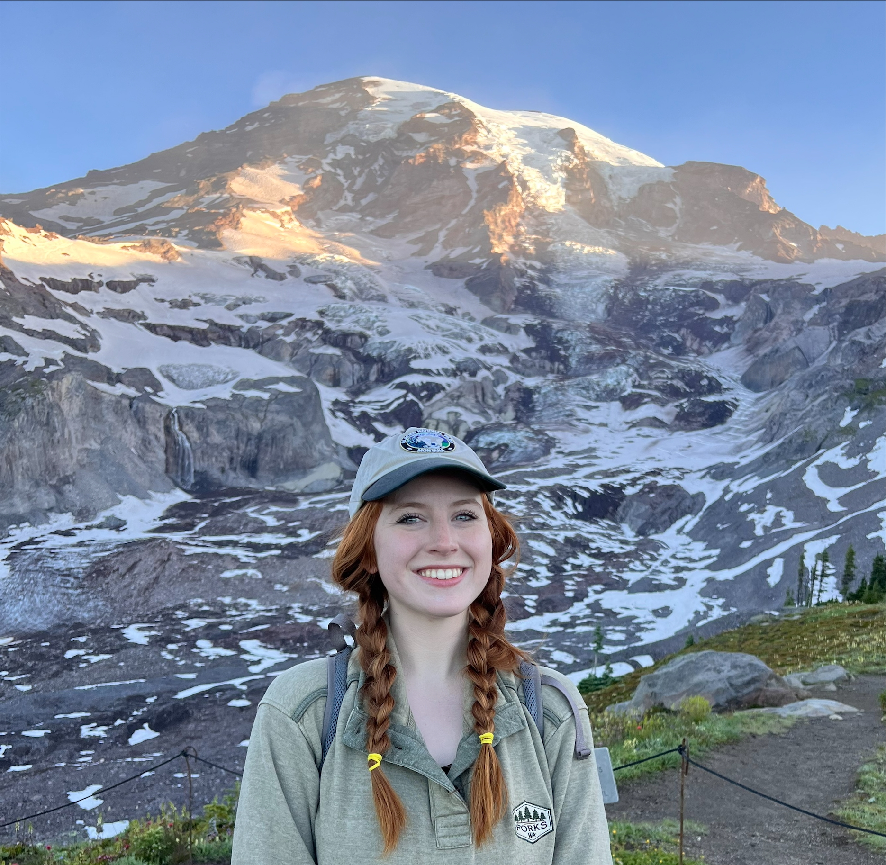

  
  <h1>Madelyn Willis</h1>

I am currently an M.Sc. graduate student in crop and soil sciences at the University of Georgia. My research primarily focuses on digital soil mapping where I look at soil nutrient and landscape connections. By using advanced geospatial techniques, my work aims to understand soil connections and their implications for precision agriculture and sustainable land management strategies.

### Links:
- [LinkedIn](https://linkedin.com/in/madelyn-willis-36a466158/)
- [Pedology Lab Page](https://pedology.uga.edu/)

### CV:
-  [Curriculum Vitae](https://madelynwillis3.github.io/research/about/cv/).
