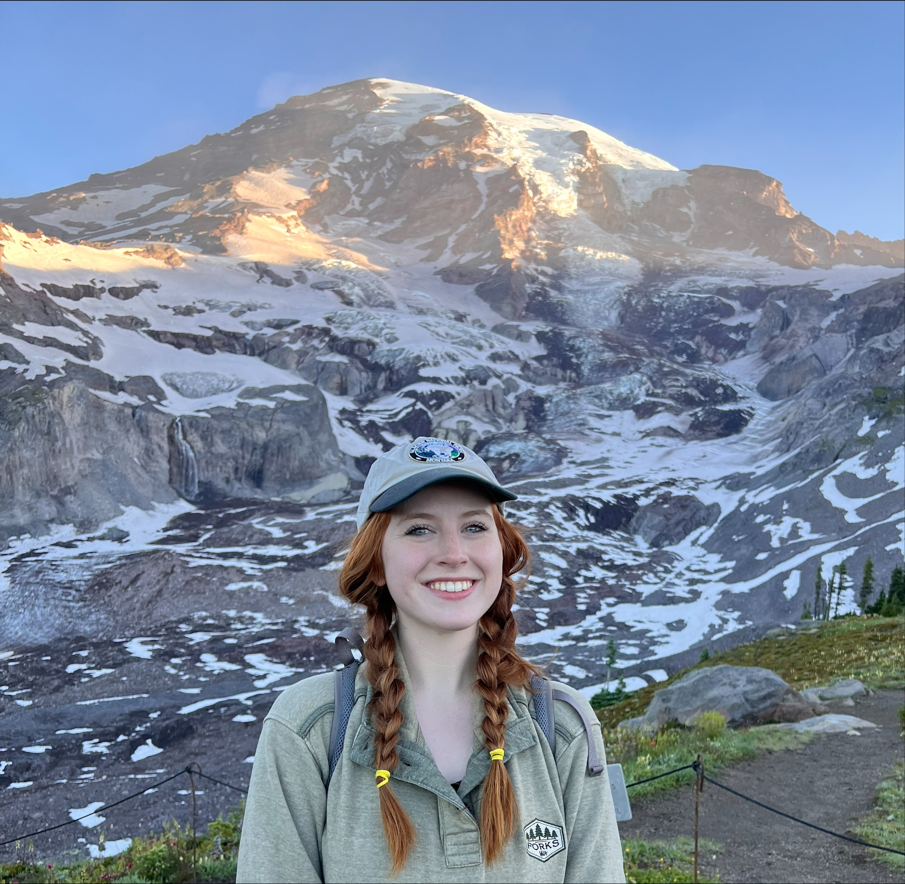

<!-- Navigation bar -->
<nav style="display:flex; gap:1.5rem; justify-content:center; margin-bottom: 2rem;">
  <a href="/" style="text-decoration:none; color:#37a000; font-weight:bold;">Home</a>
  <a href="/about" style="text-decoration:none; color:#37a000; font-weight:bold;">About</a>
  <a href="/publications" style="text-decoration:none; color:#37a000; font-weight:bold;">Publications</a>
</nav>

  
  

    

      Welcome! I am Madelyn Willis, an M.S. Student studying soil science at the University of Georgia. I focus on digital soil mapping and landscape-nutrient connections to further our understanding of agricultural soils for sustainability and productivity.
    

  

